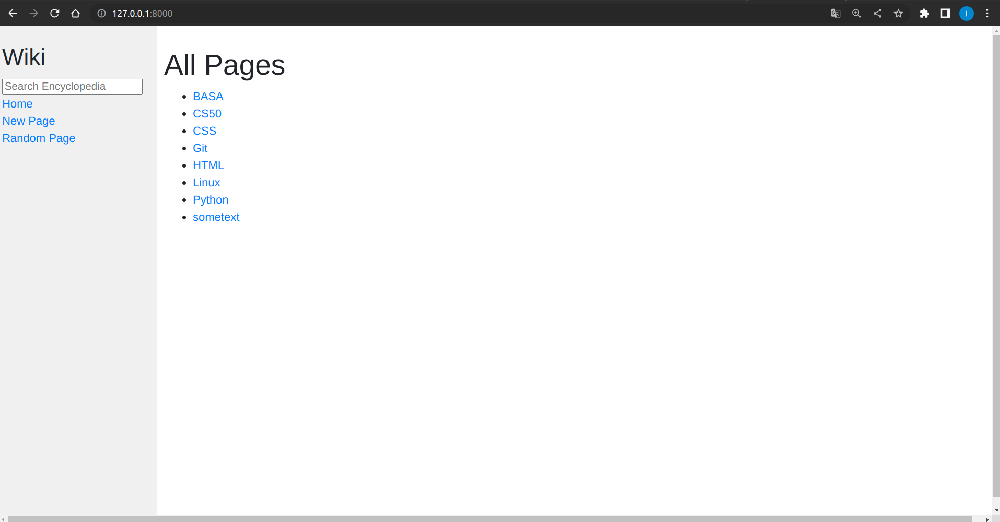
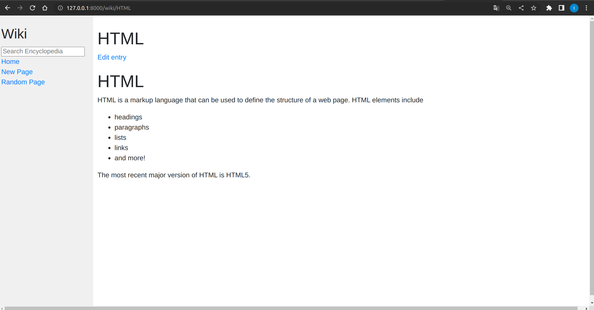
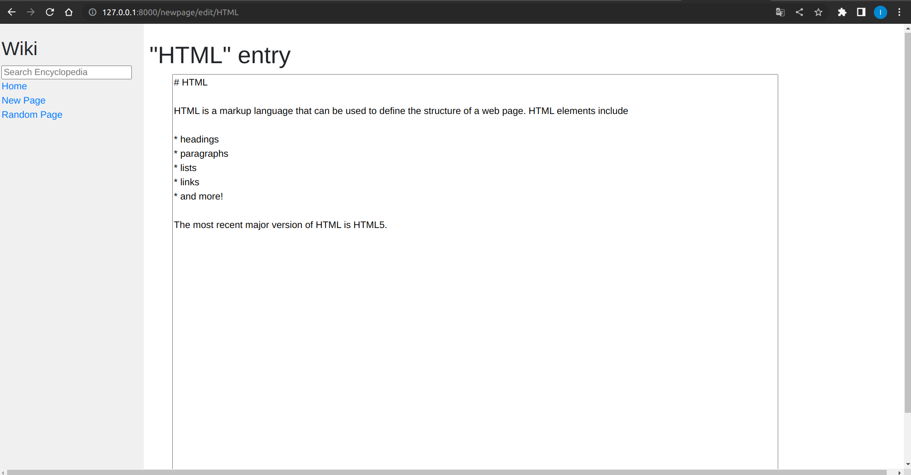
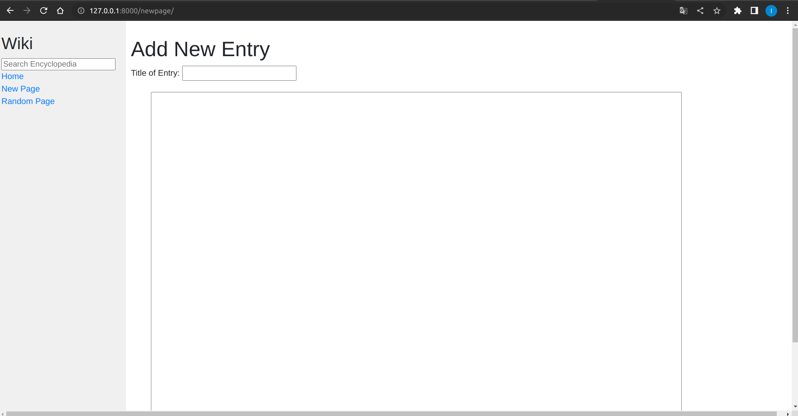

# wiki
**Wiki** is a free online encyclopedia consisting of many articles on various topics, similar to Wikipedia. This is my variant of solving the second task in the course "Web programming with Python and JavaScript".

From the home page

it is possible to view any article

and edit it

it is also possible to create and add your own articles

or browse some random article.
